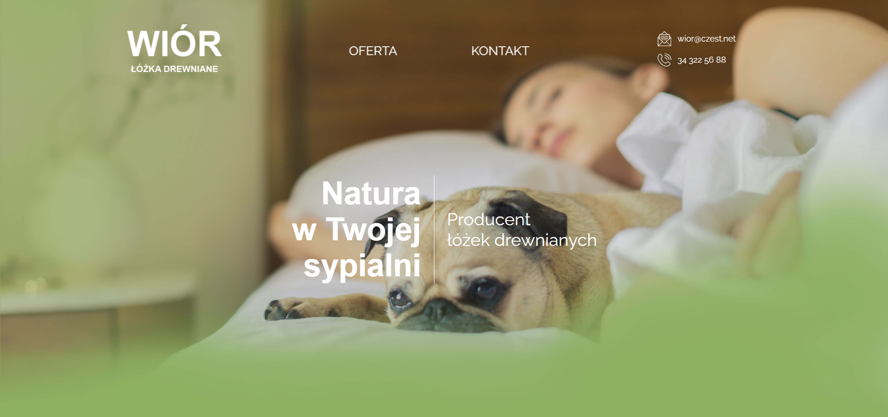
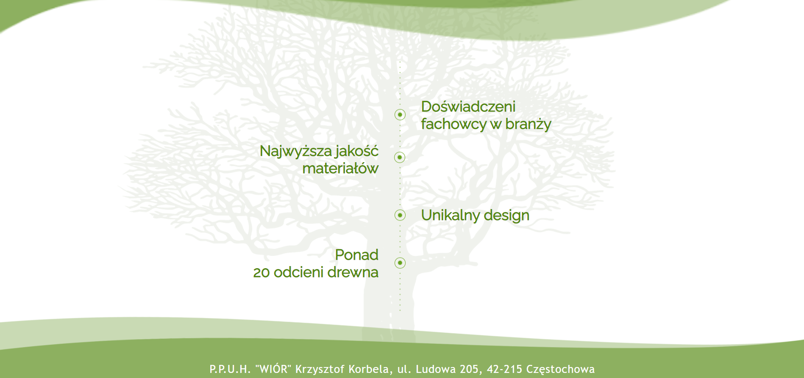
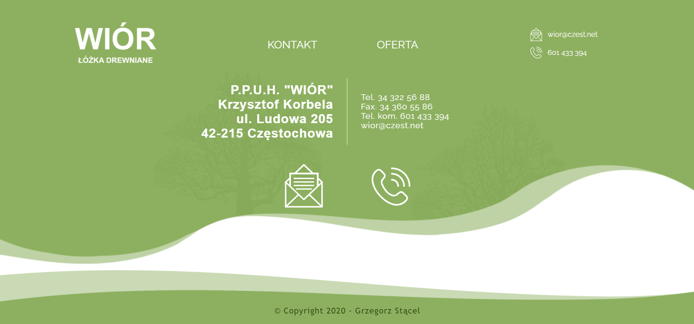
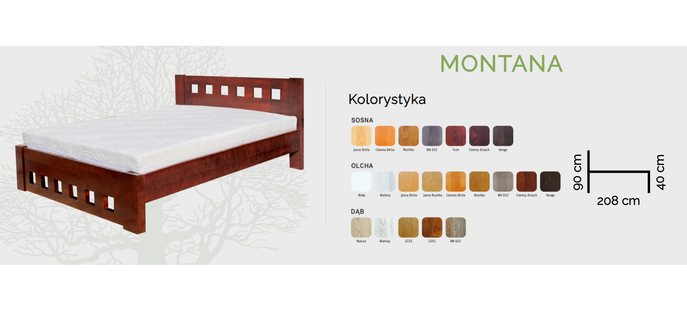
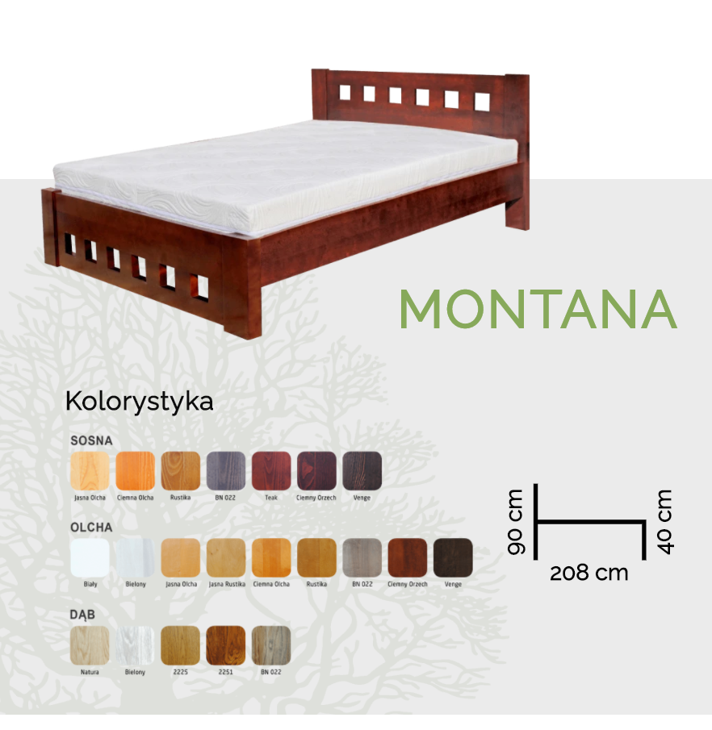

# #6 Wior
> This is my 6# website.
> This is the website of the manufacturer of sleeping beds.
>
> [Wior](http://provo.webd.pro/wior/index.html)

## Table of contents
* [General info](#general-info)
* [Screenshots](#screenshots)
* [Technologies](#technologies)
* [Status](#status)
* [Contact](#contact)

## General info
I make this website according to the project made by [@JustynaStępnik](mailto:justyna.stepnik@gmail.com).

The website was made in the mobile first approach.

## Screenshots

***

***

***

***

## Technologies
* CSS - vesrion 3
* HTML - vesrion 5
* JavaScript
* SCSS

### Extension
* [Glightbox](https://biati-digital.github.io/glightbox/)
* [Vivify](http://vivify.mkcreative.cz/)

## Status
Project is: _finished_

## Contact
Created by [@Grzegorz Stącel](mailto:stacelgrzegorz@gmail.com) - feel free to contact me!
